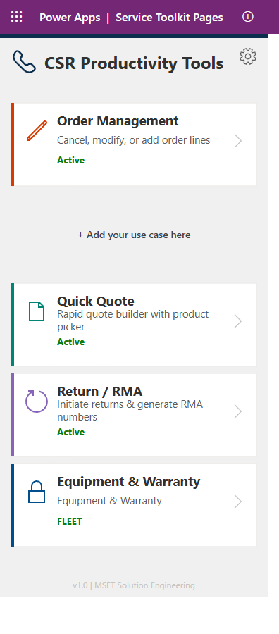

# Service Toolkit for D365 Customer Service

Custom entities and web resources that extend the **Dynamics 365 Customer Service Workspace** with manufacturing service management — warranty claims, RMA / credit memos, parts, product serials, and customer orders — surfaced in the agent **productivity pane**.

<p align="center">
  
</p>

> **Latest release: [v1.2.2.0](https://github.com/billwhalenmsft/service-toolkit-for-d365-cs/releases/latest)** &nbsp;·&nbsp; [Engagement hub & docs →](https://billwhalenmsft.github.io/service-toolkit-for-d365-cs/)

## Download

Install files are published as **[GitHub Release assets](https://github.com/billwhalenmsft/service-toolkit-for-d365-cs/releases/latest)** — pick the build for your scenario:

| Build | File | Use when |
|---|---|---|
| **Managed** | `ServiceToolkit_Managed_1_2_2_0.zip` | Customer / production installs · clean uninstall · one-click gallery deploys |
| **Unmanaged** | `ServiceToolkitGeneric_1_2_2_0.zip` | Demo / POC envs · SE customization (components stay editable) |

Release notes: [PDF](release/v1.2.2.0/ServiceToolkit_v1.2.2.0_Release_Notes.pdf) · [Word](release/v1.2.2.0/ServiceToolkit_v1.2.2.0_Release_Notes.docx)

## What's new in v1.2.2.0

- **Canvas app opens in Power Apps Studio** — fixed the prior `ErrOpeningDocument` (the app is now Studio-authored and fully editable).
- **Field Service & Marketing dependencies removed** — imports cleanly into FS-free / Marketing-free **managed environments**. Prerequisites are only **Customer Service, Sales, and Product Management**.
- **ShipEngine removed**; the home screen adds a **“+ Add your use case here”** extensibility card.
- **Two builds — managed + unmanaged** — each verified: **Solution Checker Critical 0 / High 0**, and **StageSolution = zero Field Service / Email dependencies**.

Custom entities and web resources that extend the Dynamics 365 Customer Service Workspace with manufacturing-specific service management capabilities.

> **⚠️ IMPORTANT DISCLAIMER**
>
> This solution is provided **as-is** for demonstration and enablement purposes only. It is **not an official Microsoft product** and is **not supported by Microsoft Product Support Services**. By installing this solution, you acknowledge that:
>
> - This is a **community/field-developed solution** — not a 1st-party Microsoft offering
> - Any modifications, customizations, or deployments are **your organization's responsibility**
> - Microsoft makes **no warranties**, express or implied, regarding this solution's fitness for production use
> - You should **test thoroughly in a non-production environment** before deploying to production
> - **Support** for this solution is limited to the GitHub Issues tab on this repository
> - This solution **creates custom tables and columns** in your Dataverse environment — review the component list below before installing
> - **Uninstalling** this solution will **delete the custom tables and all data** stored in them
>
> **USE AT YOUR OWN RISK.**

---

## What It Does

Adds manufacturing and service-specific entities to D365 Customer Service, enabling warranty claim management, RMA/credit memo processing, parts tracking, and product serial number management — all integrated into the CS Workspace agent experience.

---

## What Is Deployed

### Custom Tables (Entities)

| Table | Logical Name | Description | Key Relationships |
|-------|-------------|-------------|-------------------|
| **Warranty Claim** | `cr74e_warrantyclaim` | Track warranty claims from intake to resolution | Lookup to `product` (Product Management) |
| **Credit Memo and RMA** | `cra1f_creditmemoandrma` | Return merchandise authorization and credit processing | Lookup to `incident` (Service) |
| **Parts** | `cr74e_parts` | Parts catalog with product linkage | Lookup to `product` (Product Management) |
| **Product Serial** | `cr74e_productserial` | Serial number tracking with warranty linkage | Lookup to `product` (Product Management) |
| **Customer Order** | `trn_customerorder` | Order tracking within the service context | — |
| **Claim Status** | `cr74e_claimstatus` | Status tracking codes for warranty claims | — |
| **Root Cause** | `cr74e_rootcause` | Root cause analysis codes for defect categorization | — |
| **Customer Interaction** | `cr74e_customerinteraction` | Interaction history records | — |
| **Department** | `cr74e_department` | Department routing and assignment | — |
| **User** | `cr74e_user` | Extended user attributes for service routing | — |

### Custom Option Sets

| Option Set | Description |
|------------|-------------|
| `cr74e_claimsapprovalstatus` | Approval workflow status values |
| `cr74e_products` | Product category classification |
| `cr74e_warrantystatus` | Warranty claim lifecycle states |

### Web Resources

| Resource | Logical Name | Description |
|----------|-------------|-------------|
| **Service Toolkit Loader** | `bw_ServiceToolkitLoader` | HTML sideloader for the CS Workspace productivity pane — renders custom panels (orders, warranty status, RMA tracking) alongside the case form |
| **BI RMA Dashboard** | `cra1f_bi_rma` | RMA analytics and reporting dashboard |

### Canvas App

| App | Description |
|-----|-------------|
| **Service Toolkit Pages** — *CSR Productivity Tools* | The agent-facing canvas app shown above: Order Management, Quick Quote, Return / RMA, and Equipment & Warranty, plus a **“+ Add your use case here”** extensibility card. Studio-authored — opens for editing in Power Apps Studio. |

### Calculated Fields / Business Rules

| Field | Table | Description |
|-------|-------|-------------|
| `cra1f_dayssincereceipt` | Warranty Claim | Auto-calculates days since the claim was received |

---

## Prerequisites

### Required (the solution will not import without these)

| Dependency | Solution Name | Included With |
|------------|--------------|--------------|
| **D365 Customer Service** | `msdynce_Service` | Any CS license (Essentials, Professional, Enterprise) |
| **Product Management** | `msdynce_ProductManagement` | Included with D365 Sales or CS |
| **Enhanced Case Experience** | `msdyn_ModernCaseManagement` | Included with CS Enterprise (auto-installed) |

### NOT Required

- **Field Service** — not needed (all FS dependencies removed in v1.2.2.0; the canvas app ships and opens in Studio)
- **Marketing / Customer Insights – Journeys** — not needed
- **Asset Common** — not needed
- **Power BI** — not needed
- **Azure resources** — not needed

### Permissions

The installing user needs:
- **System Administrator** or **System Customizer** security role
- Access to **make.powerapps.com** for the target environment

End users need:
- Read/write access to the custom tables listed above
- Standard CS Workspace access

---

## Installation

### Step 1: Download the solution

Get the build for your scenario from **[Releases](https://github.com/billwhalenmsft/service-toolkit-for-d365-cs/releases/latest)**:

| Build | File | Use when |
|---|---|---|
| **Managed** (recommended for customers) | `ServiceToolkit_Managed_1_2_2_0.zip` | Production / customer installs; clean uninstall |
| **Unmanaged** | `ServiceToolkitGeneric_1_2_2_0.zip` | Demo / POC; you want to customize components |

Both require **Customer Service, Sales, and Product Management** (no Field Service, no Marketing).

### Step 2: Import

#### Option A: Power Apps maker portal

1. Download your chosen ZIP from [Releases](https://github.com/billwhalenmsft/service-toolkit-for-d365-cs/releases/latest)
2. Go to [make.powerapps.com](https://make.powerapps.com) → **Solutions** → **Import solution**
3. Upload the ZIP → **Next** → **Import**
4. When the import finishes, **publish all customizations** if prompted

#### Option B: PAC CLI

```bash
# Authenticate
pac auth create --url https://your-org.crm.dynamics.com

# Import the managed build (recommended for customers)
pac solution import --path ServiceToolkit_Managed_1_2_2_0.zip --publish-changes
```

### Step 3: Configure the Service Toolkit in CS Workspace

1. Open **D365 Customer Service admin center**
2. Navigate to **Workspaces** then **Agent Experience Profiles**
3. Select your agent profile then **Productivity Pane** then toggle On
4. Under productivity tools, add `bw_ServiceToolkitLoader` as a custom web resource
5. The Service Toolkit renders in the right-side productivity pane when an agent opens a case

### Step 4: Assign Security

1. Go to **Settings** then **Security** then **Security Roles**
2. Edit the roles your CS agents use (e.g., "Customer Service Representative")
3. Add read/write/create permissions for:
   - Warranty Claim
   - Credit Memo and RMA
   - Parts
   - Product Serial
   - Customer Order
   - Claim Status, Root Cause (read at minimum)

---

## Repository Structure

```
service-toolkit-for-d365-cs/
  README.md
  index.html                          <- Engagement hub (served via GitHub Pages)
  docs/
    screenshot.png                    <- App screenshot (this README)
  src/
    bw_ServiceToolkitLoader.html      <- Service Toolkit sideloader source
    cra1f_bi_rma.html                 <- RMA analytics dashboard source
  release/v1.2.2.0/
    ServiceToolkit_v1.2.2.0_Release_Notes.pdf
    ServiceToolkit_v1.2.2.0_Release_Notes.docx

# Install zips (managed + unmanaged) are published as GitHub Release assets
# — see the Releases tab, not the repo tree.
```

---

## How It Works (Technical)

### Service Toolkit Loader

The `bw_ServiceToolkitLoader` web resource is an HTML page that:
1. Detects the current case context from the CS Workspace session
2. Reads the case's customer account, product, and order data via Dataverse Web API
3. Renders interactive panels for order details, warranty status, and RMA processing
4. Updates in real-time as the agent navigates between case sessions

### Custom Table Design

- All custom tables use the `cr74e_` or `cra1f_` publisher prefix
- Lookup relationships to standard entities (`product`, `incident`) use standard Dataverse polymorphic lookups
- No plugins, workflows, or server-side code — all logic is client-side or calculated fields
- Tables are designed for the manufacturing service context but can be adapted to any industry

---

## Customization Guide

### Adding Fields to Custom Tables

1. Open [make.powerapps.com](https://make.powerapps.com) then Tables
2. Find the table (e.g., Warranty Claim)
3. Add columns as needed — the solution is unmanaged so all components are editable
4. Update the associated forms and views

### Modifying the Service Toolkit Panels

1. Edit `src/bw_ServiceToolkitLoader.html` locally
2. The HTML is self-contained — vanilla JS, no build step
3. Upload the modified file as a web resource replacement via Solutions

### Connecting to External Systems

The Service Toolkit Loader can be extended to call external APIs (ERP, PLM, etc.) by adding fetch calls in the JavaScript section. Common integration points:
- Order details from SAP/Oracle/D365 F&O
- Warranty validation from an external warranty system
- Parts availability from an inventory management system

---

## Uninstalling

To remove this solution:
1. Go to **make.powerapps.com** then Solutions
2. Find "Service Toolkit for Customer Service"
3. Click the three dots then Delete

> **Warning:** Deleting the solution will permanently delete all custom tables and any data stored in them. Export your data first if needed.

---

## Contributing

Issues and pull requests welcome.

---

## License

MIT

---

> *Built by the Discrete Manufacturing Agentic CoE team. Not an official Microsoft product. Not supported by Microsoft Product Support Services. Use at your own risk.*
